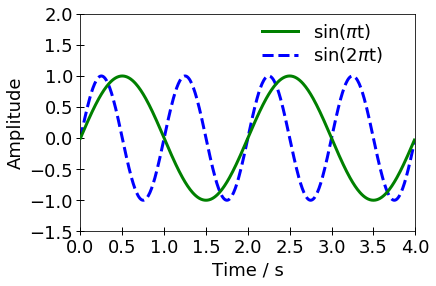

toc: True

# Python関連

このページでは, 本研究室に配属された学生を対象に, [python](https://www.python.org/)の使い方について説明します.
研究室内で備忘録として活用することを想定しており, 書かれている内容には偏りがあるとともに, 表現が必ずしも正確でない可能性があることに注意してください. 

以下では, Pythonのインストール方法やコーディングをする際のヒントおよび注意点について述べます. 
Pythonの詳しい使い方については[公式ドキュメント](https://docs.python.org/ja/3/)を参照するのが良いと思います.
公式ドキュメントの活用方法がわからないという場合には教員or先輩などに相談してください. 


## インストール

[Anacondaディストリビューション](https://www.anaconda.com/distribution/)のインストールをお勧めします. 
[リンク先](https://www.anaconda.com/distribution/#download-section)のダウンロード画面で, 適切なOSを選択し, "Python 3.x version"(xは最新版の数字)をダウンロードしてください .

上記Anacondaは, 本家のPythonに種々の機能を追加したアプリケーションです.
Pythonで数値計算やデータ処理をするためには, 以下で紹介するように追加のライブラリをインポートすることになりますが, Anacondaには[scipy](https://www.scipy.org/), [sympy](https://www.sympy.org), [Matplotlib](https://matplotlib.org/)などの重要なライブラリがあらかじめ含まれています. 一般的にAnacondaはデータサイエンスのためのプラットフォームと言われますが, 広く科学技術計算をするためのプラットフォームとして有能です. 

Anacondaをインストールすると[SPYDER](https://www.spyder-ide.org/)(Scientific Python Development Environment)という開発環境が利用できます.


<!---
## 追加ライブラリのインストール

基本的にはcondaを使って追加のライブラリをインストールします

(詳細は準備中です)
--->


## 数値計算ライブラリの利用


ここでは例題として以下の最適化問題(線形計画問題)[^玉置,2005]を考えます. 
[^玉置,2005]: 玉置 編, システム最適化 (オーム社, 2005).

\begin{align}
 &\max_{x_1, x_2} & f = 28 x_1 + 14 x_2 \quad\\
 &\mathrm{subject} \, \mathrm{to} & 4 x_1 + 3 x_2 \le 24  \quad \\
 & & 2 x_1 + x_2 \le 10  \quad \\
 & & x_1, x_2 \ge 0  \quad
\end{align}

この問題の目標は, $f$の値が最大となるような変数$x_1$および$x_2$の組を探すことです.
ただし, 変数$x_1$および$x_2$は"subject to"以降の条件を満たす必要があります.
ちなみに, 解は$(x_1,\,x_2)$ $=$ $(3,\,4)$であり, 最大値は$z_\mathrm{max}=148$です. 

最適化問題を解くためには何らかのアルゴリズムが必要です.
線形計画法の場合には, シンプレックス法[^luenberger,2016]や内点法[^luenberger,2016]などが知られています.
これらのアルゴリズムを自身でコーディングしてもよいですが, Pythonの場合,
例えば[scipy](https://www.scipy.org/)という科学技術計算用のライブラリを無償で利用できます(当然原理を理解した上でこれらのツールを利用するようにしてください).
以下では, scipyのoptimizeモジュールに含まれる[linprog](https://docs.scipy.org/doc/scipy/reference/generated/scipy.optimize.linprog.html)を使って上記の問題を解きます. 

[^luenberger,2016]: 例えば, D.G. Luenberger and Y. Ye, Linear and Nonlinear Programming, 4th ed. (Springer,2016).

### 関数を使ったコードの例

linprogは線形計画問題(Linear Programming)を解くための関数です. 
関数の引数として, 解きたい問題を行列表現した際の係数を与えると, 出力として最適解を返してくれます.
linprogの詳しい使い方は[公式ドキュメント](https://docs.scipy.org/doc/scipy/reference/generated/scipy.optimize.linprog.html)を確認してください. 
これを見ると, 公式ドキュメント内の$c$や$A_\mathrm{ub}$, $b_\mathrm{ub}$などに相当するリスト(1D arrayや2D array)を作って関数linprogの引数とすればよいことがわかります. 

下記が関数linprogを使ったコードの例です.
[ダウンロードはこちら](https://github.com/hoshino06/ui_for_scipy/blob/master/for_education/sample_with_function.py)

```python
"""
------------------------
sample_with_function.py
------------------------
- 数値計算を実行する関数を直接呼び出すプログラムの例
- scipy.optimizeの関数linprog(線形計画法を解く関数)を直接利用
- linprogの使い方: https://docs.scipy.org/doc/scipy/reference/generated/scipy.optimize.linprog.html
"""
# scipyのoptimizeパッケージを呼び出してoptという名前を付ける
import scipy.optimize as opt

# 関数linprogに渡す引数を定義 (この部分をどのように書くかが問題!!)
c = [-28, -16]
A = [[4,3],[2, 1]]
b = [24, 10]
x0_bounds = (0, None)
x1_bounds = (0, None)
bounds = [x0_bounds, x1_bounds]

# scipy.optimize(opt)のlinprog関数を使って最適化問題の解(res)を取得
res = opt.linprog(c, A_ub=A, b_ub=b, bounds=bounds)

# 結果を表示
print(f'fmax = {-res.fun}')
print(f'x1 = {res.x[0]}, x2 = {res.x[1]}')
```

以上のコードは取り立てて読みにくいものではありません.
しかし, 扱う問題がより大規模なものになると, 同じ方法では非常に読みづらいコードになる恐れがあります.

例えば, 電力需要を賄うための最適な電源投資に関する問題[^biggar,2014]を解く場合には, 上記の変数$x_1,\,x_2$に相当する変数が, 多数の電源の導入量$K_i\,(i = 1,\, 2,\,3,\dots)$および各時刻における発電量$P_{it}\,(t =  1,\, 2,\,3,\dots)$になります.
この際, 各電源は導入量以上に発電できないため, $P_{it}\le K_i$という制約条件を表現する必要があります.
この制約条件を上記のコードと同じように実装しようとすると, どの変数が$x=(x_1,\,x_2,\,\dots)$の何番目の要素だったかを確認し, 係数行列($c$, $A_\mathrm{ub}$, $b_\mathrm{ub}$)中の対応する要素を編集することになります.
そうすると, そのコードの大部分は, "制約条件を設定する"という目標から少しそれて, 配列のインデックスを確認したり, 確認したインデックスを用いて値を代入するという退屈な作業のために費やされることになります. 
この作業を上記のコード中にそのまま書き入れていくと, そのコードは非常に読みづらくなります. 
その編集過程ではミスが生じやすく, コードの正しさを検証することが苦痛になります. 

[^biggar,2014]: D.R. Biggar and M.R. Hesamzadeh, The Economics of Electricity Markets (John Wiley & Sons, 2014).

上記の苦痛を回避するために有効なのが, 以下で紹介する, オブジェクトを用いる方法です. 

### オブジェクトを使ったコードの例

「オブジェクト」や「オブジェクト指向」とは何か.
この問いに対しては色々な意見があり, 一言で答えを表現することは私にはできません.
ここでは, 上記の例について, いかに読みやすく, 拡張性のあるコードを書けるかということを通じて, オブジェクト指向の考え方の一端を(本質的だと思う部分を)理解してもらうことを目的とします.

上の例で指摘したように, コードをより大規模なものにしていくときには, 当初一行で表現できていた処理が複雑になり, 本来の目標から逸れる内容を記述する必要がでてきます.
この際に, 新たな関数を定義して, そこにすべてを任せるということは自然な発想です.
上記の例の場合には, 設定したい拘束条件に関する情報を, 新たに定義する関数の引数として与え, 戻り値として配列$A_\mathrm{ub}$および$b_\mathrm{ub}$を返してもらえば便利です. 

このような関数を定義することは, オブジェクト指向でなくても普通に実施されるでしょう.
オブジェクト指向ならではの考え方は, 配列$A_\mathrm{ub}$および$b_\mathrm{ub}$を生成する関数を, 
これらの配列を格納しておくデータ型と紐づけて管理する点です. 
具体的には, 下記で紹介するコードを示しながら改めて説明しますが, 関数linprogに渡すべき引数のデータ(配列$A_\mathrm{ub}$や$b_\mathrm{ub}$)を格納しておくための「オブジェクト」を用意し, 各配列を生成するための関数を同じオブジェクトに対して定義します.

オブジェクト指向の考え方では, 上記のような, オブジェクトに紐づけられた関数を, 単なる関数とは区別して「メソッド」と呼びます.
通常の関数とは異なりメソッドの場合には, 第0番目の引数として, メソッドを保有するオブジェクトが代入されます. この様子を象徴的に表すと以下のように書いて差し支えないと思います.

    method(obj, arg1, arg2)  # methodという関数にオブジェクトobjおよび引数(arg1, arg2)を代入するイメージ

ただし, 実際には上記の操作は, 下記ようにメソッドの呼び出しとして記述されます.

    obj.method(arg1, arg2)  #オブジェクトojbのメソッドmethodを呼び出し     

<br>
さて, 下記がオブジェクトを利用したコード([sample_with_object.py](https://github.com/hoshino06/ui_for_scipy/blob/master/for_education/sample_with_object.py))の例です. 
なお, ここで利用するオブジェクト(obj_linprog)の仕様は別のファイル([optimize_linprog_minimal.py](https://github.com/hoshino06/ui_for_scipy/blob/master/for_education/optimize_linprog_minimal.py))に記述し, それをモジュールとして読み込んでいます. 内容の説明はコードの下を見てください. 


```python
"""
------------------------
sample_with_object.py
------------------------
- 数値計算を実行するオブジェクトobj_linprogを作成する例
- オブジェクトobj_linprogの仕様(クラス定義)は別ファイルoptimize_linprog_minimal.pyに記述
- オブジェクトojb_linprogが, 関数linprogの引数となるデータの保持および成形を担当
"""
# optimize_linprog_minimalモジュールを読み込んでoptという名前を付ける
import optimize_linprog_minimal as opt

# sympyというパッケージを読み込んでsymという名前を付ける
import sympy as sym

# sympyパッケージのsymbols関数を利用して, x1およびx2という変数(Symbol)を定義
x1, x2 = sym.symbols('x1, x2')

# オブジェクトobj_linprogを作成 
# (obj_linprogは, optimize_linprog_minimal.pyに定義されたLinProgクラスのオブジェクト)
obj_linprog = opt.LinearProg()

# obj_linprogに付随する「メソッド」を利用して, 最適化問題を定義
# (この部分が読みやすくなっていることが重要!!)
obj_linprog.set_decision_variables((x1, x2))
obj_linprog.set_cost_function('max', 28*x1 + 16*x2)
obj_linprog.append_inequality(4*x1 + 3*x2 <= 24)
obj_linprog.append_inequality(2*x1 +   x2 <= 10)
obj_linprog.set_bound(x1, 0, None)
obj_linprog.set_bound(x2, 0, None)

# 最適化問題の解(res)を取得
res = obj_linprog.get_result()

# 結果を表示
print(f'fmax = {-res.fun}')
print(f'x1 = {res.x[0]}, x2 = {res.x[1]}')
```


## グラフの作成

数値計算や実験などで得た結果をグラフにする場合には
[Matplotlib](https://matplotlib.org/)というライブラリを使用するのが便利です. 
以下にサンプルの図とコードを示すので参考にしてください. 



```python
# matplotlibのpyplotモジュールを読み込み
import matplotlib.pyplot as plt

# プロットするデータを準備
import numpy as np
time = np.arange(0.0, 4.0, 0.01)
sin_t = np.sin(np.pi *time)
sin_2t = np.sin(2 * np.pi * time)

# pltを初期化します
# (この例では不必要. 同じスクリプトで複数の図を作成する場合などに使用.)
plt.clf()

# データをプロット
plt.plot(time, sin_t,  label='sin($\pi$t)',  zorder=2, ls='-',  lw=3, c='g')
plt.plot(time, sin_2t, label='sin(2$\pi$t)', zorder=1, ls='--', lw=3, c='b')

# x軸とy軸のラベルを設定
plt.xlabel('Time / s', fontsize=18)
plt.ylabel('Amplitude',fontsize=18)

# x軸とy軸のプロット範囲を設定
plt.xlim(0,4)
plt.ylim(-1.5,2.0)

# x軸とy軸の目盛りを設定を設定
plt.xticks(fontsize=15)
plt.yticks(fontsize=15)
plt.tick_params(direction='inout', width=1, length=8)

# グラフの周囲の余白をゼロに設定
plt.margins(0)

# 凡例の見た目を設定
plt.legend(loc='upper right', bbox_to_anchor=(0.95,1.04), #凡例の位置
           frameon=False, #凡例の囲みは不必要
           fontsize=18, #凡例のフォントサイズ
           ncol=1, labelspacing=0.2 #凡例の並び方
           )

# グラフを出力
# (bbox_inches="tight"は出力した図の一部が切れないようにするため)
plt.savefig('sin_cos.png', bbox_inches="tight")
```

上記のサンプルはMatplotlibの中でも[pyplot](https://matplotlib.org/api/_as_gen/matplotlib.pyplot.html#module-matplotlib.pyplot)というモジュールを用いて作成しています. 
Matplotlibでグラフを作る際には, pyplotに定義されたコマンドを利用する方法と, オブジェクト指向APIを活用する方法の2通りがあります.
Web上ではこれら2つの方法が混在したコードが目立ちますが,
通常はオブジェクト指向APIを使用する必要はありません.
基本的にはpyplotのコマンドのみで対応するようにしてください. 


<br><br> <!--- 参考文献との間にすきまをあけるため --->