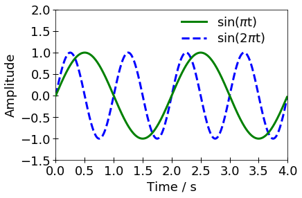

## グラフの作成

数値計算や実験などで得た結果をグラフにする場合には
[Matplotlib](https://matplotlib.org/)というライブラリを使用するのが便利です. 
以下にサンプルの図とコードを示すので参考にしてください. 

上記のサンプルはMatplotlibの中でも[pyplot](https://matplotlib.org/api/_as_gen/matplotlib.pyplot.html#module-matplotlib.pyplot)というモジュールを用いて作成しています. 
Matplotlibでグラフを作る際には, pyplotに定義されたコマンドを利用する方法と, オブジェクト指向APIを活用する方法の2通りがあります.
Web上ではこれら2つの方法が混在したコードが目立ちますが,
通常はオブジェクト指向APIを使用する必要はありません.
基本的にはpyplotのコマンドのみで対応するようにしてください. 

   <!--- 参考文献との間にすきまをあけるため --->